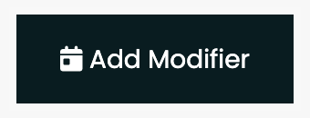
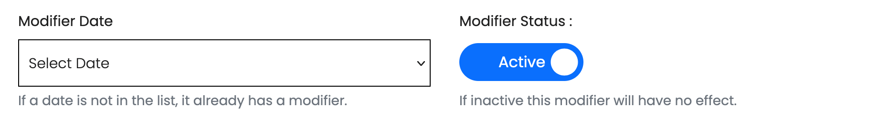
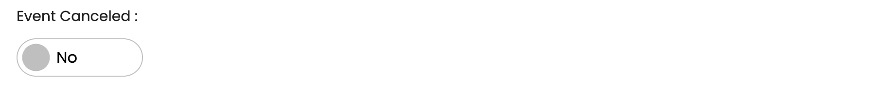
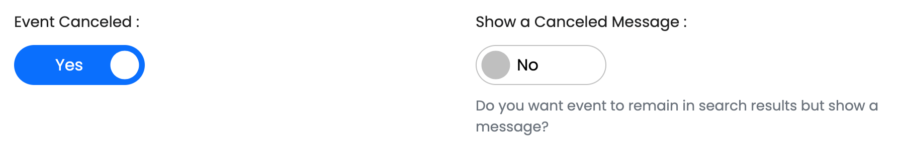
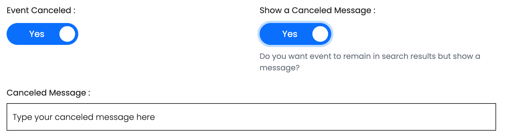
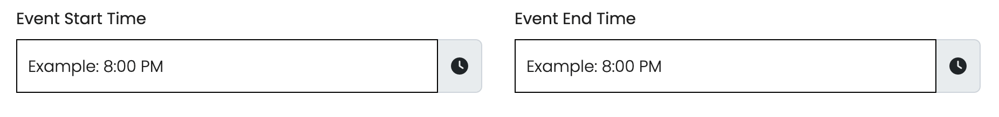
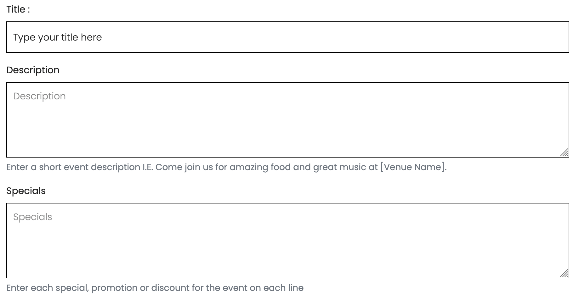
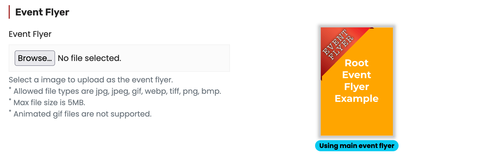
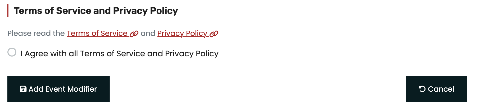

# Add An Event Modifier

### Open New Event Modifier Form

From the `Event Modifiers` list of an event click the `Add Modifier` button in the top right to load the `Add Event Modifier` form

<figure><figcaption></figcaption></figure>

### Complete Event Modifier Form

Lets review the event modifier form

#### Event Date & Status

<figure><figcaption></figcaption></figure>

The `Modifier Date` is a select box of all the dates in this events schedule. . Select the date from the select box that you wish to modify


If the date you are looking for is not in the list there is already an event modifier for that date


Set the `Modifier Status` toggle to Active or In-Active


In-Active event modifiers have no affect on the events schedule.


#### Event Canceled?

<figure><figcaption></figcaption></figure>

The `Event Canceled` tells the system if this modifier is canceling the event or just changing other event specifics

If an event is canceled it gives you the option to show a canceled message or not

<figure><figcaption></figcaption></figure>


If Show a Canceled Message is No the event will be completely removed from all searches and the events schedule.


<figure><figcaption></figcaption></figure>

If you choose to show a message, you will be allowed to enter a message that will appear on that events instance in the search and event page. This message should be kept brief and to the point


Showing a message should only usually be used when an event is canceled on short notice and your regular event attendees would be expecting to see it in the schedule


#### Event Start & End Time | \*_Optional_

<figure><figcaption></figcaption></figure>

`Event Start Time` and `Event End Time` are _**optional**_. Entering a time in either of these fields will override the root events start and/or end time for this events instance.

#### Event Title, Description & Specials | \*_Optional_

<figure><figcaption></figcaption></figure>

The `Title`, `Description` and `Spcials` are optional. Entering information in any of these will override the root events corresponding information for this events instance.

#### Event Flyer | \*_Optional_

<figure><figcaption></figcaption></figure>

Uploading an `Event Flyer` is optional. If an `Event Flyer` is uploaded it replace the root events flyer for this events instance.

#### Agree to Terms of Service, Privacy Policy & Save

<figure><figcaption></figcaption></figure>

Once all desired event modifications have been made you can agree to the [Terms of Service](https://kjpro.info/terms-of-service) and [Privacy Policy](https://kjpro.info/privacy-policy) and click the `Add Event Modifier` button. If your `Event Status` is set to `Active` the `Event Modifier` will take effect immediately. &#x20;
