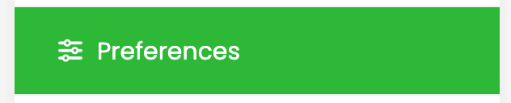
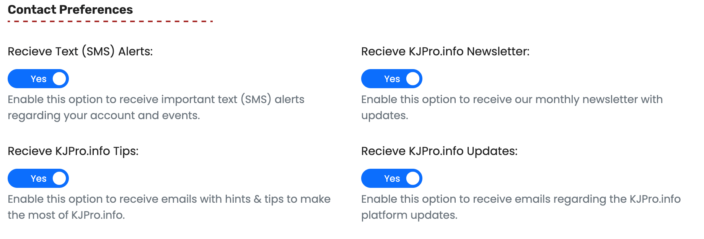
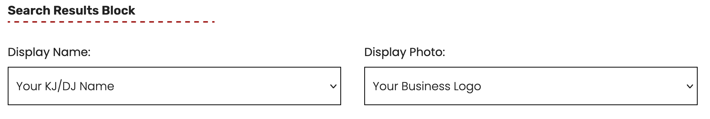
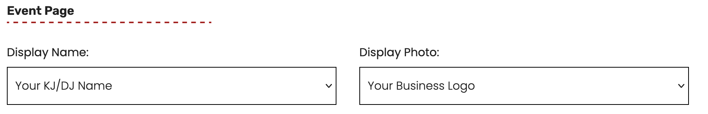
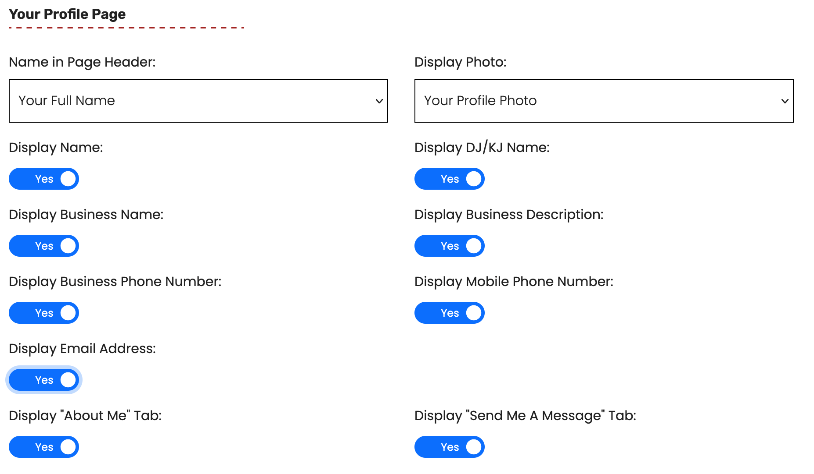

# Your Preferences

From your `Host Dashboard` click on the `Preferences` link in the Dashboard Menu


Please note that the KJPro.info site uses short server caching for some functions to speed up performance so some changes may not reflect on the website immediately.


<figure><figcaption></figcaption></figure>

## The `Edit Preferences` Form

### Contact Preferences

<figure><figcaption></figcaption></figure>

From here you can opt out of receiving text messages or any of the optional email lists we use.&#x20;

### Search Results Block

<figure><figcaption></figcaption></figure>

By selecting an option for `Display Name` and `Display Photo` you choose what is used for your search results on the KJPro.info website.

### Event Page

<figure><figcaption></figcaption></figure>

This gives you the same options for `Display Name` and `Display Photo` as the `Search Results Block` and applies to the events page, both the root event page and any specific date event pages.

### Your Profile Page

<figure><figcaption></figcaption></figure>

Here you can set `Name in Page Header` and `Display Photo` in relation to your `Host Profile Page`. you can also turn on and off any combination of your profile information as well as hiding the `About Me` and the `Send Me A Message` tabs if you prefer not to use these features.&#x20;

### Save Your Preferences

<figure><figcaption></figcaption></figure>

When you have `Your Profile Preferences` set you can click the `Save Changes` button and the changes will become active on the KJPro.info website.&#x20;
